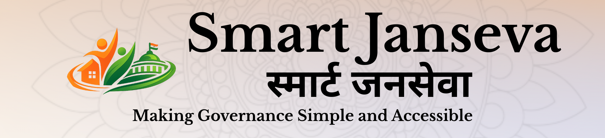
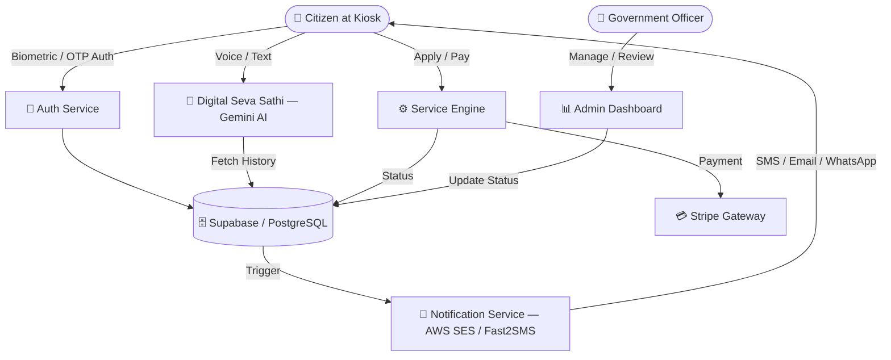

<div align="center">

<!-- ═══════════════════════════════════════════════════════════════ -->
<!--                     HERO HEADER BANNER                        -->
<!-- ═══════════════════════════════════════════════════════════════ -->




<br/>


<br/>


<br/><br/>

<!-- ═══════════════════════════════════════════════════════════════ -->
<!--                    STATUS & CORE BADGES                       -->
<!-- ═══════════════════════════════════════════════════════════════ -->


<br/>

<!-- TECH STACK BADGES -->


<br/>


<br/>


<br/>

<!-- COMPLIANCE BADGES -->


<br/><br/>

<!-- ═══════════════════════════════════════════════════════════════ -->
<!--                      QUICK LINKS                              -->
<!-- ═══════════════════════════════════════════════════════════════ -->

<a href="YOUR_DEMO_LINK_HERE"></a>
&nbsp;
<a href="YOUR_PPT_LINK_HERE"></a>
&nbsp;
<a href="YOUR_GITHUB_LINK_HERE"></a>
&nbsp;
<a href="YOUR_VIDEO_DEMO_LINK_HERE"></a>

</div>

---

## 📋 Table of Contents

| # | Section |
|:---:|---------|
| 01 | [✨ Vision & Overview](#-vision--overview) |
| 02 | [🚀 Quick Start](#-quick-start) |
| 03 | [🏛️ Department-wise Features](#️-department-wise-features) |
| 04 | [♿ Accessibility & Inclusion](#-accessibility--inclusion) |
| 05 | [🛡️ Security Architecture](#️-security-architecture) |
| 06 | [🏗️ System Architecture](#️-system-architecture) |
| 07 | [📊 Project Workflow](#-project-workflow) |
| 08 | [🗄️ Database Schema & Technology](#️-database-schema--technology-breakdown) |
| 09 | [⚙️ Technology Stack](#️-technology-stack) |
| 10 | [📁 Project Structure](#-project-structure) |
| 11 | [🔑 Configuration & Environment](#-configuration--environment) |
| 12 | [🌐 Deployment & Feasibility](#-deployment--feasibility) |
| 13 | [🗺️ Roadmap](#️-roadmap) |
| 14 | [🤝 Contributing](#-contributing) |

---

## ✨ Vision & Overview

<table>
<tr>
<td width="60%">

**Smart Janseva - Suvidha** is a next-generation, enterprise-grade **AI-powered e-governance platform** designed for India's public **Suvidha Kendra kiosks** and personal devices.

It combines **Face Recognition AI**, **Conversational Voice Interfaces**, and a **Unified Service Layer** to transform bureaucratic transactions into intuitive conversations — for all **1.4 billion Indians**.

<br/>

> 💬 *"Welcome back, Ramesh ji! Your water bill is due in 3 days. Shall I pay it for you using your saved method?"*
>
> — **Digital Seva Sathi**, your persistent AI governance companion

<br/>

The platform remembers every citizen's history, preferences, and pending tasks — so that governance feels like a **conversation**, not a transaction.

</td>
<td width="40%" align="center">

```
🏛️  Unified Citizen Services
🤖  AI-Powered Voice Assistant
🔐  Multi-Factor Authentication
♿  Full Accessibility Support
🌐  11+ Indian Languages
📱  Touch-Optimized Kiosk UI
💳  Integrated Stripe Payments
📊  Real-Time Admin Analytics
📜  QR-Verified PDF Receipts
🔔  WhatsApp / SMS / Email Alerts
```

</td>
</tr>
</table>

---

## 🚀 Quick Start

> **Prerequisites:** Node.js v18+, pnpm, Supabase project, Gemini API key, Stripe key

### ⚡ Setup in Minutes

```bash
# 📥 Clone the repository
git clone YOUR_GITHUB_LINK_HERE
cd smartjanseva

# 📦 Install all dependencies
pnpm install

# ⚙️ Configure your environment
cp .env.example .env
# → Fill in your API keys (see Environment Variables below)

# 🗄️ Initialize the database
# Run migrations from ./supabase/migrations in Supabase CLI or SQL Editor

# 🚀 Start the development server
pnpm run dev
```

> 🌐 Open [`http://localhost:5173`](http://localhost:5173) — you're live!

### 📜 Available Scripts

| Command | Description |
|---------|-------------|
| `pnpm install` | Install all project dependencies |
| `pnpm run dev` | Start local development server with HMR |
| `pnpm run build` | Create optimised production build |
| `pnpm run preview` | Preview the production build locally |
| `pnpm run lint` | Run ESLint code quality checks |

---

## 🔑 Configuration & Environment

Create a `.env` file in the project root:

```env
# ── Supabase ─────────────────────────────────────────────────────
VITE_SUPABASE_URL=your_supabase_project_url
VITE_SUPABASE_ANON_KEY=your_supabase_anon_key

# ── Google Gemini AI ─────────────────────────────────────────────
VITE_GEMINI_API_KEY=your_gemini_api_key

# ── Stripe Payments ──────────────────────────────────────────────
VITE_STRIPE_PUBLISHABLE_KEY=your_stripe_publishable_key

# ── Notifications ────────────────────────────────────────────────
VITE_FAST2SMS_KEY=your_fast2sms_api_key
VITE_AWS_SES_KEY=your_aws_ses_key
```

> ⚠️ **Never commit your `.env` file.** It is already covered by `.gitignore`.

---

## 🏛️ Department-wise Features

### ⛽ Gas (LPG / Utility)

| Feature | Description |
|---------|-------------|
| 📋 **Bill Tracking** | Real-time retrieval of gas connection billing history |
| 💳 **Instant Payments** | Integrated Stripe gateway for settling outstanding dues |
| 🧾 **Digital Receipts** | Auto-generated, QR-verified PDF receipts for every payment |
| 📊 **Usage Analytics** | Monthly consumption reports for consumer awareness |

---

### ⚡ Electricity

| Feature | Description |
|---------|-------------|
| 🔌 **New Connection** | Digital application for domestic / commercial power lines |
| 🔧 **Meter Replacement** | Request portal for faulty or upgraded meters |
| ✅ **Payment Status** | Visual indicators for pending / paid utility bills |
| 📈 **Usage Reports** | Charts showing electricity consumption patterns over time |

---

### 🏙️ Municipal Corporation

| Feature | Description |
|---------|-------------|
| 📜 **Birth / Death Certificates** | End-to-end digital application and live status tracking |
| 🏠 **Property Tax** | Self-assessment and integrated Stripe payment module |
| 🍚 **Ration Card Services** | Apply for new cards or manage existing family records |
| 🏪 **Trade Licenses** | Fully digital licensing portal for local businesses |

---

### 📣 Grievance Redressal (Complaints)

| Feature | Description |
|---------|-------------|
| 📷 **Photo Upload** | Attach evidence directly from the kiosk camera or storage |
| 🔄 **Live Status Tracking** | Real-time updates on complaint resolution progress |
| 🏷️ **Auto Department Tagging** | AI-powered routing to the correct local authority |
| ⏱️ **SLA Enforcement** | Automatic escalation of overdue tasks to senior officers |

**Supported Complaint Categories:**

> 🏘️ Municipal (sanitation, roads, drainage, water supply) &nbsp;|&nbsp; ⚡ Utility-related &nbsp;|&nbsp; 🏛️ Public service delays &nbsp;|&nbsp; 📋 Administrative &nbsp;|&nbsp; 🏗️ Infrastructure & civic amenities &nbsp;|&nbsp; 🤲 Welfare scheme grievances &nbsp;|&nbsp; 💻 Kiosk / digital service misuse

---

### 💰 Revenue & Land Records

| Feature | Description |
|---------|-------------|
| 🏡 **Property Tax** | View dues, self-assess, and pay in one seamless flow |
| 🗺️ **Bhulekh / Land Records** | Digital access to land ownership and revenue records |
| 📄 **Document Vault** | One-stop access to Income, Caste & domicile certificates |

---

### 🖥️ Admin & Officer Dashboards

| Feature | Description |
|---------|-------------|
| 📊 **Real-Time Analytics** | Monitor service efficiency across all departments |
| 📢 **Broadcast System** | Instant localized announcements and emergency alerts |
| 👤 **Collector Dashboard** | District-level visibility into grievance resolution rates |
| 🔔 **Notification Centre** | WhatsApp / SMS / Email receipts via Fast2SMS & AWS SES |

---

## ♿ Accessibility & Inclusion

> **First-Class Citizens — No One Left Behind**

<table>
<tr>
<td width="50%">

**👴 Senior Citizen Mode**
- 115% larger font sizes throughout
- Massive touch targets (48px minimum)
- Extended session duration
- Simplified, guided navigation flows

**👁️ High Contrast Mode**
- Yellow-on-Black specialized theme
- 3px thick borders everywhere
- WCAG 2.1 Level AA compliant
- Full screen reader compatibility

</td>
<td width="50%">

**🎙️ Voice-First Navigation**
- Zero-Touch complete navigation
- AI conversational assistant (Gemini)
- Hands-free portal usage
- Automated call support *(roadmap)*

**🌐 11+ Regional Languages**
- Hindi, Marathi, Tamil, Telugu
- Bangla, Gujarati, Kannada & more
- Native script rendering throughout
- Multilingual glassmorphic virtual keyboard

</td>
</tr>
</table>

**Compliance Standards:**


---

## 🛡️ Security Architecture

### Defense-in-Depth Layered Model

```
╔═══════════════════════════════════════════════════════════════════╗
║  🌐  FRONTEND LAYER                                               ║
║  Role-based routing  •  Input sanitization  •  Session watchdog   ║
╠═══════════════════════════════════════════════════════════════════╣
║  🔐  AUTH & ACCESS LAYER                                          ║
║  JWT tokens  •  OTP via Fast2SMS / AWS SES  •  MFA support        ║
╠═══════════════════════════════════════════════════════════════════╣
║  ⚙️   API & BUSINESS LOGIC LAYER                                   ║
║  Server-side validation  •  Authenticated requests only           ║
╠═══════════════════════════════════════════════════════════════════╣
║  🗄️   DATABASE LAYER  (PostgreSQL + Supabase RLS)                  ║
║  Row Level Security  •  Tenant-aware access  •  Least privilege    ║
╠═══════════════════════════════════════════════════════════════════╣
║  🏧  KIOSK SAFEGUARDS                                             ║
║  Auto-timeout  •  PII masking  •  Memory wipe on logout           ║
╚═══════════════════════════════════════════════════════════════════╝
```

### Threat Mitigation Matrix

| Threat Vector | Mitigation Strategy | Status |
|--------------|---------------------|:------:|
| 🔓 Unauthorized data access | Row Level Security (RLS) + RBAC | ✅ |
| 🕵️ Session hijacking on public kiosks | Short-lived sessions + Auto-logout watchdog | ✅ |
| 💉 SQL Injection / XSS | Parameterized queries + Input sanitization | ✅ |
| 🤖 API abuse | Authentication enforcement + Request validation | ✅ |
| 📡 Client-side data leakage | All sensitive logic runs server-side only | ✅ |
| 🪪 Weak authentication | OTP / Passkey auth — no passwords used | ✅ |
| 👀 PII exposure | Aadhaar, PAN masked at the UI level | ✅ |

---

## 🏗️ System Architecture



<br/>

> 📐 **Technical Architecture Diagram**

<!-- Replace path with your actual image file -->
<div align="center">

<br/><em>Figure 1 — Technical Architecture Diagram</em>
</div>

---

## 📊 Project Workflow

<!-- Replace path with your actual image file -->
<div align="center">

<br/><em>Figure 2 — End-to-End Project Workflow</em>
</div>

---

## 🗄️ Database Schema & Technology Breakdown

<table>
<tr>
<td width="50%" align="center">

<!-- Replace path with your DB schema image -->

<br/><em>📊 Database Schema & RLS Policies</em>

</td>
<td width="50%" align="center">

<!-- Replace path with your technology breakdown image -->

<br/><em>⚙️ Technology Breakdown</em>

</td>
</tr>
</table>

---

## ⚙️ Technology Stack

<table>
<tr>
<th>Layer</th>
<th>Technology</th>
<th>Purpose</th>
</tr>
<tr>
<td>⚛️ <strong>Frontend</strong></td>
<td>


</td>
<td>Core UI framework, fast builds</td>
</tr>
<tr>
<td>🎨 <strong>Styling</strong></td>
<td>


</td>
<td>Design system, animations, primitives</td>
</tr>
<tr>
<td>📦 <strong>State</strong></td>
<td>


</td>
<td>Global state & theme management</td>
</tr>
<tr>
<td>🗄️ <strong>Backend / DB</strong></td>
<td>


</td>
<td>Data layer, auth, Row Level Security</td>
</tr>
<tr>
<td>🤖 <strong>AI / ML</strong></td>
<td>


</td>
<td>Voice assistant & face recognition</td>
</tr>
<tr>
<td>💳 <strong>Payments</strong></td>
<td>


</td>
<td>Secure payment processing</td>
</tr>
<tr>
<td>📱 <strong>OTP / SMS</strong></td>
<td>


</td>
<td>Mobile OTP delivery</td>
</tr>
<tr>
<td>📧 <strong>Email</strong></td>
<td>


</td>
<td>Email verification & receipts</td>
</tr>
<tr>
<td>📄 <strong>Documents</strong></td>
<td>


</td>
<td>Signed receipts & certificates</td>
</tr>
<tr>
<td>🔗 <strong>Icons</strong></td>
<td>


</td>
<td>Consistent UI iconography</td>
</tr>
</table>

---

## 📁 Project Structure

```text
smart-janseva/
│
├── 📂 src/
│   ├── 📂 components/
│   │   ├── 📂 common/          # ChatBot, VoiceAssistant, Session Management
│   │   ├── 📂 layouts/         # KioskLayout — the core fullscreen wrapper
│   │   └── 📂 ui/              # Radix-based primitive components
│   │
│   ├── 📂 pages/               # Feature pages
│   │   ├── 📂 bills/           # Gas, Electricity, Water billing
│   │   ├── 📂 complaints/      # Grievance filing & live tracking
│   │   ├── 📂 documents/       # Certificate applications & vault
│   │   ├── 📂 admin/           # Admin & Collector dashboards
│   │   └── 📂 revenue/         # Property tax & land records
│   │
│   ├── 📂 db/                  # Supabase client & API wrappers
│   ├── 📂 hooks/               # Accessibility, Auth, custom hooks
│   └── 📂 contexts/            # React Contexts (Auth, Theme, Language)
│
├── 📂 supabase/
│   ├── 📂 migrations/          # SQL Schema & RLS policies
│   └── seed.sql                # Test data for development
│
├── 📂 assets/                  # ← Place your images here
│   ├── technical-architecture-diagram.png
│   ├── project-workflow.png
│   ├── database-schema.png
│   └── technology-breakdown.png
│
├── 📂 public/                  # Static assets & PWA manifests
├── logo.png                    # Project logo (root level)
├── .env                        # Environment variables (never commit!)
├── vite.config.ts              # Vite configuration
├── tailwind.config.ts          # Tailwind CSS configuration
└── package.json                # Project dependencies
```

---

## 🌐 Deployment & Feasibility

### Target Environment

| Aspect | Details |
|--------|---------|
| 🖥️ **Client** | Any device with a modern Chromium-based browser |
| ☁️ **Backend** | PostgreSQL server (Supabase cloud) with secure API access |
| 🔀 **Deployment Model** | Hybrid — Cloud-orchestrated + local kiosk hardware |
| 📶 **Internet Dependency** | Medium-High *(AI voice & Stripe: High; browsing & forms: Medium)* |
| 📴 **Offline Mode** | Planned — partial support for cached forms & local data logging |

### Kiosk-Specific UI Optimizations

```
✅  Fullscreen Kiosk Mode       — distraction-free layout for public use
✅  Custom Virtual Keyboard     — multilingual glassmorphic on-screen input
✅  Large Tap Targets (48px+)   — prevents touch errors on kiosk screens
✅  Visual Touch Feedback       — every tap provides immediate confirmation
✅  Scrollbar-Free UX           — native scrolling for clean kiosk experience
✅  Edge-First UI               — minimal nav for high-latency environments
✅  Offline Mirroring           — citizen data cached for read-only access
✅  Session Watchdog            — auto-logout on unattended kiosk detection
```

---

## 🗺️ Roadmap

```
✅  Phase 1 — MVP Complete
    ├─ Unified billing & Stripe payment flows
    ├─ Grievance redressal with SLA tracking
    ├─ 11+ language + full accessibility support
    ├─ Admin & Collector real-time dashboards
    └─ QR-verified signed PDF receipts

🔄  Phase 2 — In Progress
    ├─ Complete voice-first agentic AI navigation
    ├─ SMS notifications for all service updates
    └─ Activity tracking + email summary reports

📅  Phase 3 — Planned
    ├─ Full offline mode with local caching
    ├─ Biometric hardware (scanner + thermal printer)
    ├─ Face recognition instant login for visually impaired
    ├─ Voice-command-based Stripe payments (hands-free)
    ├─ Direct DBT (Direct Benefit Transfer) real-time status
    └─ Predictive Governance — AI anticipating needs proactively
```

---

## 🤝 Contributing

We welcome contributions from the community!

```bash
# 1. Fork the repository on GitHub
# 2. Create your feature branch
git checkout -b feature/your-feature-name

# 3. Make your changes and commit with a clear message
git commit -m "feat: describe your change clearly"

# 4. Push to your fork
git push origin feature/your-feature-name

# 5. Open a Pull Request — we'll review it promptly!
```

For security vulnerabilities, please refer to [SECURITY.md](SECURITY.md) — **do not open a public issue** for security concerns.

---

<!-- ═══════════════════════════════════════════════════════════════ -->
<!--                        FOOTER                                 -->
<!-- ═══════════════════════════════════════════════════════════════ -->

<div align="center">

<br/>

**Developed with ❤️ by Team MAKSQUARE for a Digital India**

<br/>

[](https://github.com/NayaKunal30/Smart-Janseva---Suvidha)
[](https://digitalindia.gov.in)


<br/>

*Smart Janseva — Governance Made Simple. Services Made Accessible.*


</div>
