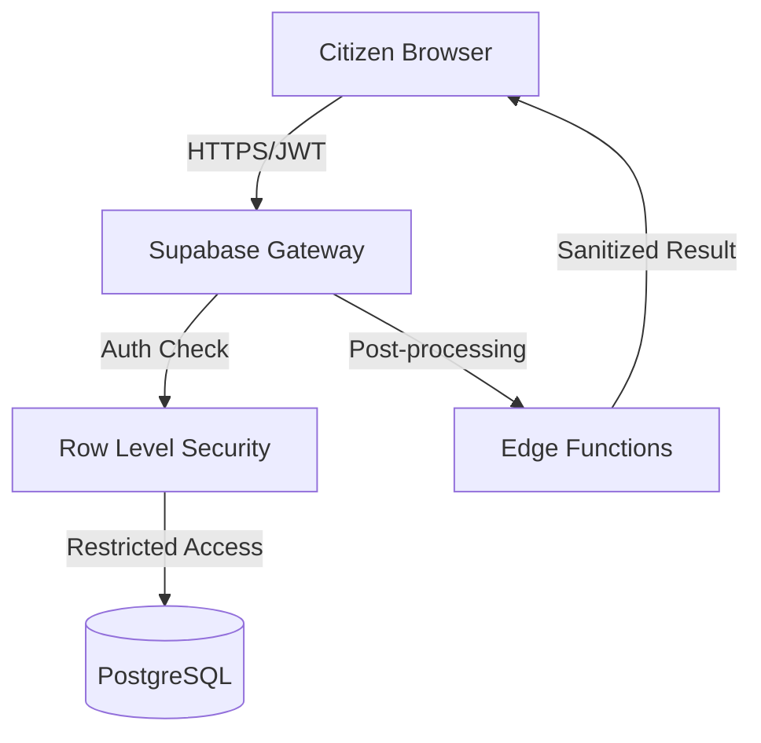

# Security Design & Threat Modeling: Smart Janseva

This document outlines the security architecture, threat model, and mitigation strategies implemented in the Smart Janseva platform.

## 1. Security by Design Principles

Smart Janseva follows the **Security by Design** philosophy, ensuring that security is not an afterthought but a core requirement of the system architecture.

### A. Principle of Least Privilege
- **Row Level Security (RLS):** Every table in the database has RLS enabled. Users can only `SELECT`, `INSERT`, `UPDATE`, or `DELETE` rows that belong to them (verified via `auth.uid()`).
- **Role-Based Access Control (RBAC):** The system distinguishes between `citizen`, `officer`, and `admin` roles, with separate RLS policies for administrative functions.

### B. Secure Defaults
- All database tables are private by default.
- Auth sessions are managed via secure, HTTP-only cookies/secure local storage with short-lived JWTs.
- Automatic email/OTP verification is required for account activation.

### C. Defense in Depth
- **Transport Layer Security (TLS 1.3):** All data in transit is encrypted.
- **Form Validation:** Multi-tier validation (Frontend/Backend) prevents malformed data.
- **Sanitization:** Content is sanitized before rendering to prevent Cross-Site Scripting (XSS).

---

## 2. Threat Modeling (STRIDE Approach)

| Threat Category | Description | Mitigation Strategy in Smart Janseva |
|:--- |:--- |:--- |
| **Spoofing** | Attacker pretending to be a citizen or admin. | Supabase Auth with JWT signatures. Optional MFA for sensitive accounts. |
| **Tampering** | Modifying bill status or complaint data. | Database-level constraints and RLS. `created_at` and `updated_at` handled via triggers. |
| **Repudiation** | User denying they performed an action. | Audit logging in the `recent_activities` table for all critical state changes. |
| **Information Disclosure** | Unauthorized access to other citizens' data. | Strict RLS: `user_id = auth.uid()`. PII (Personally Identifiable Information) is encrypted at rest. |
| **Denial of Service** | Flooding the API to crash the service. | Rate limiting implemented at the Supabase/Gateway level. Edge Functions for heavy processing. |
| **Elevation of Privilege** | Citizen trying to access admin dashboard. | Route guards in React matches user role + RLS policies check `profiles.role` on the server. |

---

## 3. Security Architecture Diagram

## 4. Ongoing Security Tasks
1. **Regular Dependency Audits:** Periodically running `npm audit` to patch vulnerabilities.
2. **Environment Secret Management:** All keys (Groq API, Supabase Secret) are stored in `.env` and never committed to version control.
3. **Database Backups:** Automated daily backups with point-in-time recovery.

---
*Created as part of the Smart Janseva Security Initiative.*
